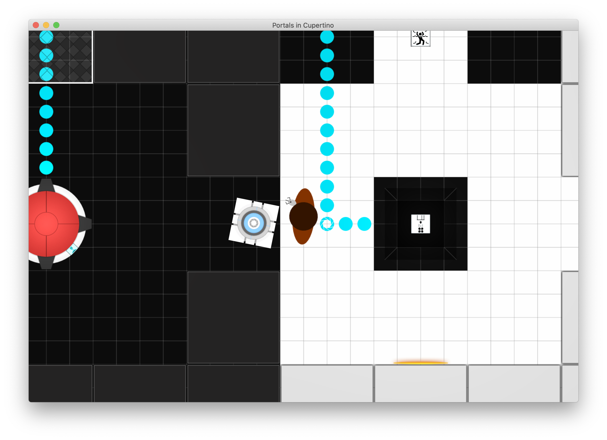

# Portals in Cupertino (Portal Jam)

Portals in Cupertino was an attempt at a 30-day game jam with friends to create a complete game inspired by (and follows closely to) the _Portal_ series.

## Game Objectives

- Create a complete game using Swift and SpriteKit. (Requires Xcode)
- ~~Follow an isometric layout of levels in the game. ([Example A](https://i.pinimg.com/736x/62/f5/a8/62f5a896f228d01abd6b54f67b1097ee--isometric-drawing-isometric-design.jpg) | [Example B](https://i.pinimg.com/originals/02/c0/6f/02c06fa0701103e2a004f2ff8990d24a.jpg))~~
- Adopt an orthographic style like CS2D. ([Example](https://proxy.duckduckgo.com/iu/?u=http%3A%2F%2Ffiles.gamebanana.com%2Fimg%2Fss%2Fmaps%2F_15786-.jpg&f=1&nofb=1))
- Introduce new elements and iterate over previous elements from Portal/Portal 2.

## Requirements/Dependencies

- macOS 10.15 (Catalina) or higher
- Xcode 11 or higher

## License

This project is licensed under the Mozilla Public License v2.0. 

_Portal_ and the assets herein are registered trademarks of Valve Software. This project is not affiliated with (or endorsed by) Valve Software.